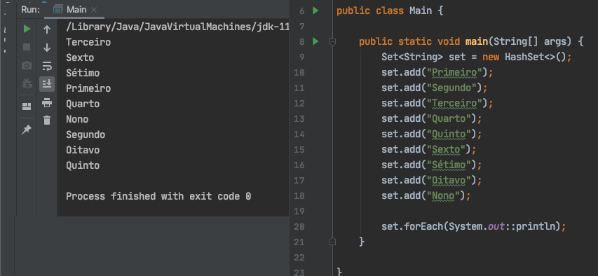
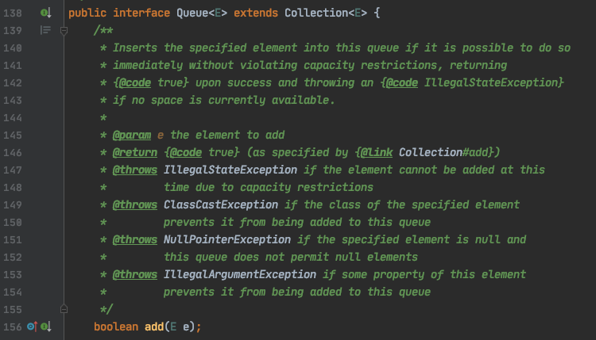
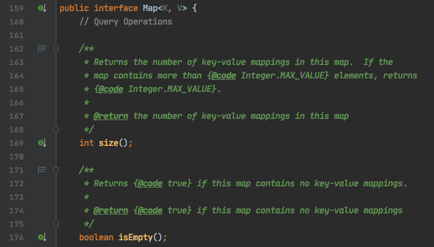

##### Um assunto que pode não ser tão interessante a todos, mas com certeza é muito importante. Vamos falar sobre collections!

O que é esse negócio de collections? Collections são um conjunto de interfaces e classes que fornecem uma estrutura de dados de coleção.

Por exemplo, caso você queira criar um sistema que guarda uma lista de compras, você poderá utilizar uma das implementações de collection. Uma delas é a classe ArrayList, acredito que você já deve ter ouvido falar, não é mesmo? Nela você guardaria tudo o que precisa comprar Pão, Leite, Arroz, etc.

## Iterable

Vamos começar do começo. A interface Iterable é a raiz da hierarquia e permite que toda classe que implementa-la poderá usar os recursos de iteração. Por exemplo, a capacidade de fazer um ForEach.


## Collection

A próxima da hierarquia é a interface Collection. Ela diz quais os métodos uma collection vai implementar. Ou seja, ela declara que toda collection deve ter métodos como
- ``size()`` para saber o tamanho da collection
- ``isEmpty()`` para saber se a collection está vazia
- ``add(Element e)`` para adicionar um elemento

entre muitos outros.

Mas veja bem, a **interface** não diz como adicionar um elemento em uma coleção ou como saber o tamanho. Ela apenas indica que cada coleção deverá implementar sua propria maneira de fazer isso.


## List

Seguindo o fluxo temos List, Set, Queue e Map. List é uma collection que guarda a ordem dos elementos que são inseridos e você consegue acessar os valores pela posição dos elementos na lista. Ela também guarda elementos duplicados.

Duas implementações de List são ArrayList e LinkedList. Elas têm declarações muito parecidas, porém a diferença está internamente.


**ArrayList** é uma lista que cresce de acordo com a inserção dos elementos. Caso você não declare o tamanho do ArrayList ele será redimensionado automaticamente a cada inserção, isto é, toda vez que um novo elemento for adicionado/removido toda a lista será copiada para uma nova lista com o novo tamanho. Pense no processamento necessário para manipular listas com milhares de elementos! E milhões? ☠️

**LinkedList** também não é necessário declarar o tamanho. Cada elemento contém um link para o próximo e o anterior na lista. Ou seja, ao adicionar um elemento, um ponteiro será criado para indicar o anterior e o próximo sem a necessidade de remanejar toda a lista.

*Há mais implementações de List, para conhecer [acesse a documentação oficial do Java sobre List](https://docs.oracle.com/javase/8/docs/api/java/util/List.html).*

## Set

Set não permite elementos duplicados e não guarda a ordem dos elementos, além de permitir elemento nulo. Então, se a ordem de inserção e não duplicidade de elementos é importante para você, fique ligado.

HashSet, LinkedHashSet e TreeSet são implementações comuns de Set.



Toda vez que um **HashSet** é criado, um HashMap é instanciado por debaixo dos panos. O Set não possui índice e você não poderá o recuperar um elemento pela chave.

**LinkedHashSet** é uma boa opção caso você precise manter a ordem dos elementos. Ele continuará não permitindo elementos duplicados e também não há índice.

**TreeSet** faz a ordenação automática dos elementos inseridos. Se você está inserindo uma coleção de String o retorno é em ordem alfabética. O TreeSet utiliza o método ``compare(Object o1, Object o2)`` para comparar em ordem ascendente.

*Veja outras implementações de Set na [documentação da Oracle](https://docs.oracle.com/javase/8/docs/api/java/util/Set.html).*

## Queue

Queue é uma interface que garante o comportamento de uma fila (First In First Out) para as classes que a implementam.



**PriorityQueue** é uma classe que implementa queue. A inserção será sempre após o último elemento da fila, é possível consultar o primeiro da fila e remover o primeiro. Tem todas as funções que uma fila deveria ter. O detalhe é que essa fila utilize o método ``compareTo(Object o1)`` para definir uma prioridade.

Outra classe que implementa queue é LinkedList. Ao instanciar
```java 
Queue<String> fila = new LinkedList<>();
```
você terá uma lista encadeada mas apenas com as funções de fila.

*Veja outras implementações de Queue [clicando aqui](https://docs.oracle.com/javase/8/docs/api/java/util/Queue.html)*

## Map

Se você reparar na capa deste post, verá que Map não estende de collection. Essa interface tem suas proprias definições.

Map é uma collection que guarda os elementos utilizando dois parâmetros: *Key* e *Value*. Key é a chave utilizada para acessar um valor. Value é o valor proriamente dito, aquilo que você está guardando. Map não pode conter chaves duplicadas; cada chave vai mapear um único valor.



**HashMap** é uma implementação de Map que utiliza uma função hash para endereçar os elementos da coleção. A função hash é um calculo que retorna um valor numérico. Esse valor retornado será o endereço desse elemento em um vetor criado pela linguagem. Dentro desse vetor, existe uma lista encadeada mas vamos parar por aqui para não ficar muito confuso.
A função hash pode ser sobrescrita com o método `hashCode()`.

Quando você adiciona um elemento no HashMap a chave será utilizada na função hash. Vamos ao exemplo.

Quando você insere um elemento na coleção
```java
public class LinguagensDeProgramacao {

}

Map<Integer, LinguagensDeProgramacao> linguagens = new HashMap<>();
linguagensDeProgramacao.put(1, "Java");
```
A chave (neste caso é 1) será utilizada para calcular o hash. 

*Veja outras implementações de Map na [documentação da Oracle](https://docs.oracle.com/javase/8/docs/api/java/util/Map.html)*

*Referência:*
- https://docs.oracle.com/javase/8/docs/api/java/util/Collection.html
- https://www.youtube.com/watch?v=Ma7u6KEKzPE&ab_channel=edureka%21
- https://codenuclear.com/how-arraylist-works-internally-java/#:~:text=Overview,increase%20the%20size%20of%20array.
- https://www.journaldev.com/13386/java-linkedlist-linkedlist-java
- https://www.youtube.com/watch?v=9wyov5l9a_U&ab_channel=DevDojo
- https://www.java8net.com/2020/01/how-hashmap-works-internally-in-java.html