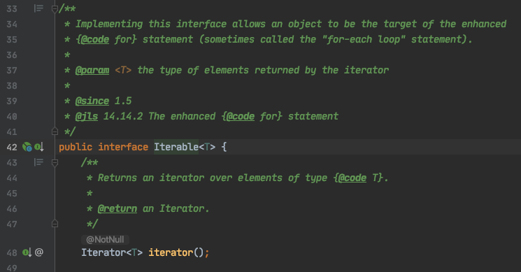
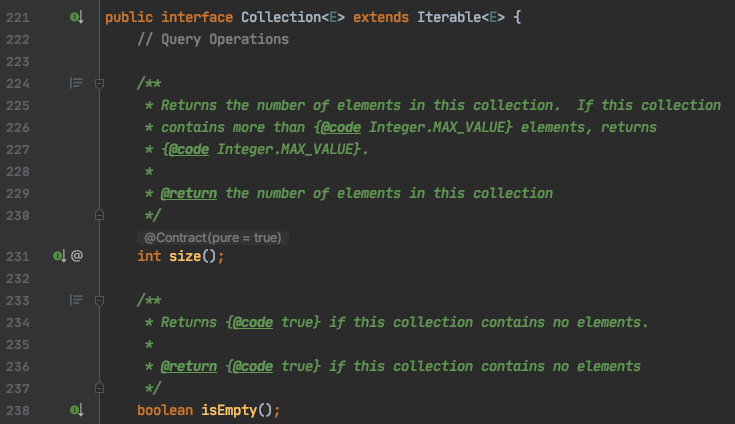
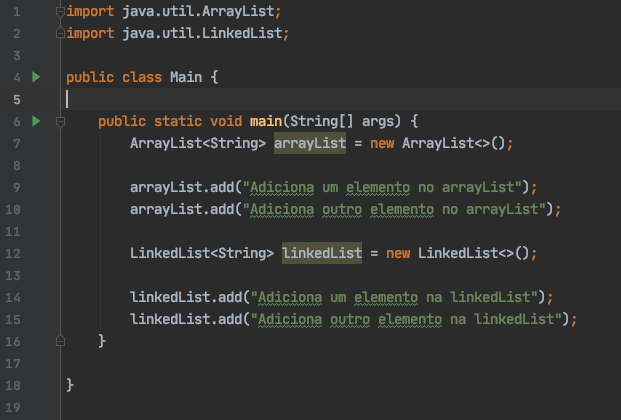

##### Um assunto que pode não ser tão interessante a todos, mas com certeza é muito importante. Vamos falar sobre collections!

O que é esse negócio de collections? Collections são um conjunto de interfaces e classes que fornecem uma estrutura de dados de coleção.

Por exemplo, caso você queira criar um sistema que guarda uma lista de compras, você poderá utilizar uma das implementações de collection. Uma delas é a classe ArrayList, acredito que você já deve ter ouvido falar, não é mesmo? Nela você guardaria tudo o que precisa comprar Pão, Leite, Arroz, etc.

## Iterable

Vamos começar do começo. A interface Iterable é a raiz da hierarquia e permite que toda classe que implementa-la poderá usar os recursos de iteração. Por exemplo, a capacidade de fazer um ForEach.

## Collection

A próxima da hierarquia é a interface Collection. Ela diz quais os métodos uma collection vai implementar. Ou seja, ela declara que toda collection deve ter métodos como
- size() para saber o tamanho da coleção
- isEmpty() para saber se a coleção está vazia
- add(Element e) para adicionar um elemento

entre muitos outros.

Mas veja bem, a **interface** não diz como adicionar um elemento em uma coleção ou como saber o tamanho da coleção. Ela apenas indica que cada coleção deverá implementar sua propria maneira de fazer isso.

## List

Seguindo o fluxo temos List, Set, Queue e Map. List é uma collection que guarda a ordem dos elementos que são inseridos e você consegue acessar os valores pela posição dos elementos na lista. Ela também guarda elementos duplicados.

Duas implementações de List são ArrayList e LinkedList. Elas têm declarações muito parecidas, porém a diferença está internamente.

**ArrayList** é uma lista que cresce de acordo com a inserção dos elementos. Caso você não declare o tamanho do ArrayList ele será redimensionado automaticamente a cada inserção, isto é, toda vez que um novo elemento for adicionado/removido toda a lista será copiada para uma nova lista com o novo tamanho. Pense no processamento necessário para manipular listas com milhares de elementos! E milhões? ☠️

**LinkedList** também não é necessário declarar o tamanho. Cada elemento contém um link para o próximo e o anterior na lista. Ou seja, ao adicionar um elemento, um ponteiro será criado para indicar o anterior e o próximo sem a necessidade de remanejar toda a lista.

*Há mais implementações de List, para conhecer [acesse a documentação oficial do Java sobre List](https://docs.oracle.com/javase/8/docs/api/java/util/List.html).*

## Set

Set não permite elementos duplicados 

Referência:
https://docs.oracle.com/javase/8/docs/api/java/util/Collection.html
https://www.youtube.com/watch?v=Ma7u6KEKzPE&ab_channel=edureka%21
https://codenuclear.com/how-arraylist-works-internally-java/#:~:text=Overview,increase%20the%20size%20of%20array.
https://www.journaldev.com/13386/java-linkedlist-linkedlist-java#:~:text=As%20we%20know%2C%20internally%20Java,represents%20it's%20elements%20as%20Nodes.&text=Left%20side%20Node%20Part%20is,Or%20Element)%20in%20the%20LinkedList.